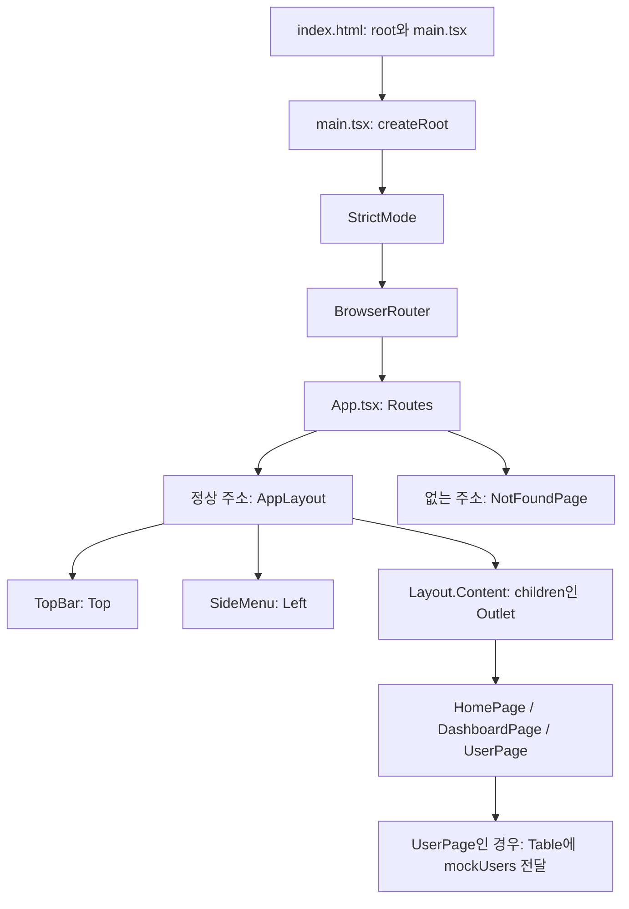
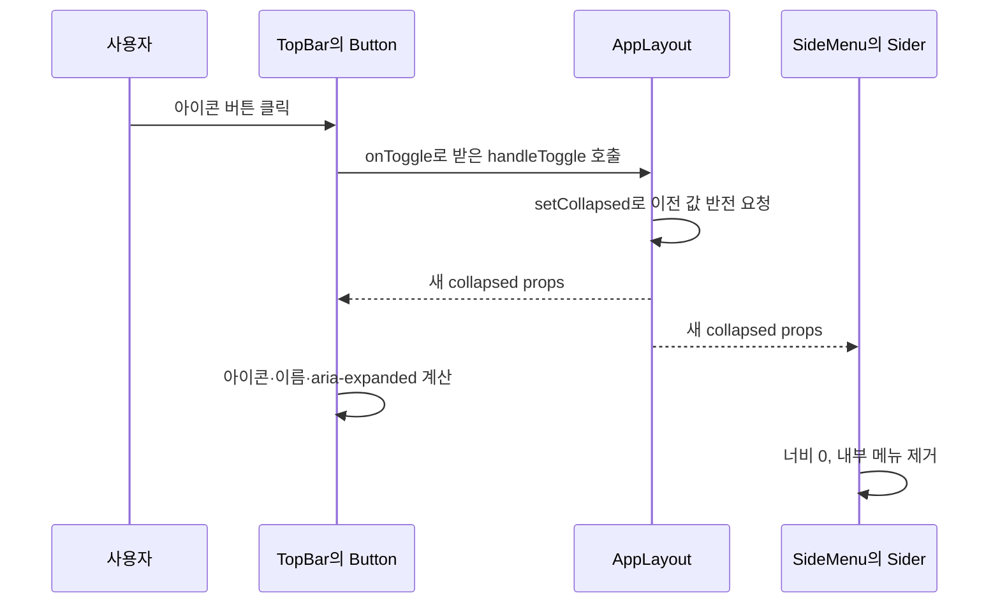

# 06단계 소스로 읽는 React · TypeScript · Ant Design 안내서

이 문서는 **06단계의 프로젝트에서 어떤 파일이 연결되고, 코드가 왜 그렇게 동작하는지** 설명한다. 소스를 옆에 열어 두고 한 절씩 읽으면 된다. 처음부터 모든 문법을 외울 필요는 없다. 먼저 화면에서 일어나는 일을 이해하고, 그 일을 만드는 코드를 확인하자.

**작성 기준:** 2026-10-01의 실제 소스. [학습 계획](./learning-plan.md)의 06단계 구현 상태를 기준으로 한다. 개발 진행 위치와 완료 여부는 학습 계획에서 관리한다. 이 안내서는 코드 읽기를 위한 보조 문서다.

설명 대상은 `src`의 모든 파일, 프로젝트 루트의 설정 파일, 기존 문서와 생성 폴더의 역할이다. 직접 작성하지 않은 `node_modules`의 라이브러리 내부 코드와 자동 생성된 `dist`, `package-lock.json`의 모든 항목은 반복해서 풀어 쓰지 않고 읽는 방법과 역할을 설명한다.

원본 소스를 보여 주는 코드 블록과 문법 이해를 위한 예시는 구분한다. 이후 단계에서 소스가 바뀌면 이 문서의 코드와 다를 수 있다. 현재 동작은 실제 소스와 학습 계획을 기준으로 확인하며, 이 안내서 전체를 매 단계 복제·갱신하지 않는다. 전체 완성 방향은 [프로젝트 로드맵](./project-roadmap.md)을 참고한다.

## 목차와 읽는 순서

**현재 그리드와의 차이:** 사용자 목록은 AG Grid Community로 교체되었다. 아래 Ant Design Table 코드·설명은 06단계 당시 참고 자료이며 현재 구현 지침이 아니다. 기본 그리드는 향후에도 Community만 사용하고 유료로 전환하지 않는다. 부족한 기능은 필요할 때 직접 개발한다. 현재 코드는 [UserPage.tsx](../src/features/users/UserPage.tsx)를 기준으로 읽는다.

| 당시 Ant Design Table | 현재 AG Grid Community | 역할 |
| --- | --- | --- |
| `Table<User>` | `AgGridReact<User>` | User 타입의 행 표시 |
| `TableColumnsType<User>` | `ColDef<User>[]` | 열 정의 배열의 타입 |
| `columns` / `dataSource` | `columnDefs` / `rowData` | 열 설정 / 사용자 배열 |
| `title` / `dataIndex` | `headerName` / `field` | 헤더 / 읽을 필드 |
| `rowKey="id"` | `getRowId`에서 `data.id` 반환 | 고유한 행 식별 |
| `render` | `valueFormatter` | 빈 부서를 `-`로 표시 |
| `scroll.x` | 열별 `minWidth`와 `flex` | 최소 너비를 유지하고 남은 너비를 비율대로 분배 |

`ClientSideRowModelModule`은 전달받은 배열을 행으로 표시하는 Community 모듈이며 `modules`에 등록한다. `domLayout="autoHeight"`는 행 수에 따라 그리드 높이를 늘려 Content에서 세로 스크롤하도록 한다. 현재 25건 전체를 표시하며 페이지 나누기는 꺼져 있다. 열 정렬·크기 변경·이동도 꺼서 기존 정적 표의 동작을 유지한다. `cellDataType: false`는 현재 문자열 표시만 필요한 열에 자동 타입 추론을 적용하지 않는 설정이다.

테마는 `App`에서 받은 `themeName`·`isDarkMode`로 `getGridTheme`이 만든다. `themeQuartz.withParams(...)`는 기본 Quartz 테마에 공통 팔레트와 모서리 설정을 반영한다. `useMemo`는 의존성 배열의 테마명·모드가 같으면 만든 테마 객체를 재사용한다. 현재 스타일은 [theme.ts](../src/theme.ts)를 확인한다. [AG Grid 모듈 안내](https://www.ag-grid.com/react-data-grid/modules/), [테마 안내](https://www.ag-grid.com/react-data-grid/theming-parameters/)

1. [현재 화면과 전체 연결 구조](#01-현재-화면과-전체-연결-구조)
2. [코드에서 먼저 알아둘 문법](#02-코드에서-먼저-알아둘-문법)
3. [HTML에서 React 시작까지](#03-html에서-react-시작까지)
4. [App.tsx: 주소와 화면 연결](#04-apptsx-주소와-화면-연결)
5. [AppLayout.tsx: 공통 화면 틀과 상태](#05-applayouttsx-공통-화면-틀과-상태)
6. [TopBar.tsx: 버튼과 시스템명](#06-topbartsx-버튼과-시스템명)
7. [SideMenu.tsx: 메뉴와 현재 위치](#07-sidemenutsx-메뉴와-현재-위치)
8. [세 페이지: 홈·대시보드·없는 주소](#08-세-페이지-홈대시보드없는-주소)
9. [사용자 타입과 가상 데이터](#09-사용자-타입과-가상-데이터)
10. [UserPage.tsx: 사용자 표](#10-userpagetsx-사용자-표)
11. [styles.css: 배치와 크기](#11-stylescss-배치와-크기)
12. [package.json과 라이브러리](#12-packagejson과-라이브러리)
13. [Vite·TypeScript·ESLint 설정](#13-vitetypescripteslint-설정)
14. [나머지 파일과 폴더](#14-나머지-파일과-폴더)
15. [사용자 동작을 처음부터 끝까지 따라가기](#15-사용자-동작을-처음부터-끝까지-따라가기)
16. [직접 확인하는 방법과 이해 점검](#16-직접-확인하는-방법과-이해-점검)

한 번에 읽기 부담스럽다면 01–04에서 앱의 시작과 주소 연결을, 05–07에서 메뉴 조작을, 08–10에서 화면과 표를, 11–14에서 스타일과 개발 도구를 읽자. 15–16은 앞에서 읽은 내용을 실제 동작으로 연결하는 부분이다.

## 01. 현재 화면과 전체 연결 구조

### 지금 사용할 수 있는 화면

| 주소 | 화면 | 현재 내용 |
| --- | --- | --- |
| `/` | 홈 | 프로젝트 설명, 대시보드·사용자 관리 링크 |
| `/dashboard` | 대시보드 | 제목과 안내 문구 |
| `/users` | 사용자 관리 | 가상 사용자 25건을 보여 주는 표 |
| 위에 없는 주소 | 없는 페이지 안내 | 안내 문구와 홈 링크 |

정상 주소의 화면은 **Top / Left / Content**를 공유한다. Top의 아이콘 버튼으로 Left를 완전히 숨기거나 다시 펼친다. Top의 시스템명을 누르면 홈으로 이동한다. 없는 주소의 안내 화면은 Top과 Left 없이 표시된다.

사용자 표에는 ID·이름·이메일·부서·활성 여부가 있다. 활성 여부는 `Y` 또는 `N`이고, 비어 있는 부서는 `-`로 표시한다. **현재 표에는 검색, 페이지 나누기, 등록·수정·삭제, 서버 조회가 없다.** [설계 문서](./prototype-design.md)의 최종 기능 목록과 현재 구현을 구분해서 읽자.

### 파일 지도

```text
si-react-template/
  index.html                    브라우저가 받는 HTML, root와 시작 스크립트
  package.json                  명령어와 의존성 목록
  package-lock.json             설치할 의존성의 구체적인 버전 기록
  vite.config.ts                Vite의 React 처리 설정
  tsconfig.json                 두 TypeScript 검사 설정 연결
  tsconfig.app.json             src에 대한 타입 검사 설정
  tsconfig.node.json            vite.config.ts에 대한 타입 검사 설정
  eslint.config.js              코드 작성 규칙 검사 설정
  .gitignore                    Git에서 제외할 파일 패턴
  README.md                     실행 방법과 문서 입구
  AGENTS.md                     AI와 함께 작업할 때의 지속 지침
  docs/
    prototype-design.md         1차 목표 설계
    learning-plan.md            개발 순서와 진행 기록
    source-guide.md             지금 읽는 소스 안내서
  src/
    main.tsx                    React와 Router 시작
    App.tsx                     주소별 화면 연결, CSS import
    styles.css                  공통 배치와 최소 스타일
    layout/
      AppLayout.tsx             Top·Left·Content 조합, 접기 상태 소유
      TopBar.tsx                메뉴 버튼과 시스템명 링크
      SideMenu.tsx              Left 메뉴, URL에 따른 선택 표시
    pages/
      HomePage.tsx              홈
      DashboardPage.tsx         대시보드
      NotFoundPage.tsx          없는 주소 안내
    features/users/
      types.ts                  YN과 User 타입
      mockUsers.ts              가상 사용자 배열
      UserPage.tsx              사용자 표와 열 정의
  public/                       현재 비어 있는 정적 파일 폴더
  node_modules/                 설치된 라이브러리와 개발 도구
  dist/                         빌드 결과
```

`layout`은 여러 화면이 공유하는 틀, `pages`는 일반 페이지, `features/users`는 사용자 관리에 필요한 화면·타입·데이터를 모은 곳이다. 폴더 이름 자체가 특별한 React 문법은 아니다. 역할을 찾기 쉽도록 정한 프로젝트 구조다.

### 시작 흐름과 화면 구조



이 그림은 주요 연결 관계다. `StrictMode`, `BrowserRouter`, `Outlet`처럼 동작을 제공하는 컴포넌트가 모두 화면에 눈에 보이는 상자를 만드는 것은 아니다.

## 02. 코드에서 먼저 알아둘 문법

새 문법을 만날 때 이 절로 돌아오면 된다. 아래 예시는 현재 코드에 등장하는 표현을 읽기 위한 설명이다.

### JavaScript, TypeScript, JSX의 관계

**JavaScript**는 브라우저에서 실행되는 언어다. 변수, 함수, 배열, 조건식은 대부분 JavaScript 문법이다. **TypeScript**는 여기에 값의 종류와 형태를 검사하는 문법을 추가한다. **JSX**는 JavaScript 코드 안에서 화면 구조를 표현하는 문법이다.

```tsx
// 현재 코드에서 사용한 표현
function DashboardPage() {
  return (
    <>
      <h1>대시보드</h1>
      <p>주요 현황을 모아서 보여 줄 화면입니다.</p>
    </>
  );
}
```

`function`과 `return`은 JavaScript이고, `<h1>` 등은 JSX다. 이 함수는 화면에 표시할 내용을 반환하는 **React 컴포넌트**다. `<DashboardPage />`처럼 컴포넌트를 사용할 때 이름을 대문자로 시작한다. `<h1>`처럼 소문자로 시작하는 것은 기본 HTML 요소다. [React 컴포넌트 설명](https://react.dev/learn/your-first-component)

| 확장자 | 현재 프로젝트의 용도 |
| --- | --- |
| `.ts` | JSX가 없는 TypeScript: 타입, 데이터, Vite 설정 |
| `.tsx` | JSX가 있는 TypeScript: 화면 컴포넌트 |
| `.js` | JavaScript: ESLint 설정 |
| `.json` | 데이터·설정: package.json 등 |
| `.css` | 화면 스타일 |
| `.md` | Markdown 문서 |

### import와 export

파일이 다른 파일의 내용을 쓰려면 내보내기와 가져오기가 필요하다.

```tsx
// 기본 내보내기: 파일의 대표 값
export default AppLayout;
// 기본 가져오기: 중괄호 없이 가져온다.
import AppLayout from "./layout/AppLayout";

// 이름을 붙인 내보내기와 가져오기
export const mockUsers: User[] = [ /* 사용자 객체들 */ ];
import { mockUsers } from "./mockUsers";

// 실행할 값이 아니라 검사에 쓸 타입만 가져오기
import type { User } from "./types";
```

위 블록은 여러 파일의 문법을 한곳에 모은 **설명용 발췌**다. 그대로 하나의 파일에 넣는 코드가 아니다.

`./`는 현재 파일이 있는 폴더를 기준으로 찾는 경로다. `../`는 한 단계 상위 폴더다. `"antd"`, `"react"`처럼 상대 경로가 없는 이름은 설치된 패키지에서 찾는다.

현재 소스에는 작은따옴표와 큰따옴표가 모두 있다. `'react'`와 `"react"`는 같은 문자열 값이다. 줄 끝의 세미콜론은 문장 경계를 표시한다. 현재 파일들의 표기 스타일이 조금 달라도 import나 컴포넌트의 기본 동작이 달라지는 것은 아니다.

`import type`으로 가져온 타입은 실행 코드에 남지 않는다. `User`라는 객체가 브라우저에서 생성되는 것이 아니다. 현재 설정의 `verbatimModuleSyntax`와도 연결되는 문법이다. [TypeScript import type 관련 설정](https://www.typescriptlang.org/tsconfig/verbatimModuleSyntax.html)

### JSX의 중괄호와 props

**props는 컴포넌트에 전달하는 값**이다. 부모는 값을 보내고, 자식은 그 값을 읽어 표시하거나 동작한다.

```tsx
<SideMenu collapsed={collapsed} />
<Layout.Sider width={208} theme="light" />
<Table<User> scroll={{ x: 720 }} />
```

이 블록도 props 문법만 보이도록 발췌한 것이다.

| 표현 | 읽는 방법 |
| --- | --- |
| `theme="light"` | 문자열 `light` 전달 |
| `width={208}` | 숫자 208 전달 |
| `collapsed={collapsed}` | 현재 변수의 값 전달 |
| `onClick={onToggle}` | 함수 자체 전달 |
| `{children}` | 변수의 내용을 이 위치에 표시 |
| `scroll={{ x: 720 }}` | 바깥 `{}`는 JSX 표현식, 안쪽 `{}`는 JavaScript 객체 |
| `<Button />` | 내부 내용이 없는 태그를 닫는 표기 |
| `<>...</>` | Fragment: 실제 DOM 요소를 추가하지 않고 여러 내용을 묶음 |
| `className="app-top"` | CSS 클래스를 연결하는 JSX 속성 |

`return (...)`의 괄호는 여러 줄의 JSX를 하나의 반환값으로 읽기 쉽게 묶는다. JSX의 `{}` 안에는 변수, 조건식, 함수 호출 같은 표현식을 넣는다. [JSX 설명](https://react.dev/learn/writing-markup-with-jsx), [props 설명](https://react.dev/learn/passing-props-to-a-component)

### 구조 분해, 콜백, 화살표 함수

```tsx
function TopBar({ collapsed, onToggle }: TopBarProps) { /* ... */ }
const [collapsed, setCollapsed] = useState(false);
```

`{ collapsed, onToggle }`은 props 객체에서 같은 이름의 값을 꺼내는 **객체 구조 분해**다. `[collapsed, setCollapsed]`는 `useState`가 반환한 두 값을 순서대로 꺼내는 **배열 구조 분해**다. 앞에 `{}`가 있는지 `[]`가 있는지를 보면 구분할 수 있다. [구조 분해 설명](https://developer.mozilla.org/en-US/docs/Web/JavaScript/Reference/Operators/Destructuring)

```tsx
(previousCollapsed) => !previousCollapsed
(menu) => menu.path === currentPath
(menu) => ({ key: menu.path, label: <Link to={menu.path}>{menu.label}</Link> })
```

`=>`는 함수를 짧게 작성하는 화살표 함수 문법이다. 앞의 괄호에는 받을 값, 뒤에는 계산할 내용이 있다. 함수 본문이 표현식 하나이면 그 결과를 반환한다. 객체를 바로 반환할 때는 `({ ... })`로 감싼다. 그래야 `{}`를 함수 본문의 시작으로 해석하지 않는다.

다른 코드에 넘겨 두고 그 코드가 필요할 때 호출하는 함수를 **콜백**이라고 한다. state 갱신 함수, `find`·`map`에 넘기는 함수, 클릭 처리 함수가 현재 코드의 예다.

### 같은 기호가 쓰인 위치에 따라 뜻이 다르다

| 코드 | 의미 |
| --- | --- |
| `children: ReactNode` | TypeScript: children 값의 타입 지정 |
| `{ path: "/" }` | JavaScript 객체: path 속성에 `/` 값 저장 |
| `onToggle: () => void` | TypeScript: 매개변수가 없고 반환값을 사용하지 않는 함수 타입 |
| `(value) => !value` | JavaScript: 실제로 실행할 함수 |
| `!collapsed` | JavaScript: true와 false 반전 |
| `getElementById('root')!` | TypeScript: null이 아니라고 단언 |
| `YN = "Y" \| "N"` | TypeScript: 둘 중 하나를 허용하는 타입 |
| `department \|\| "-"` | JavaScript: 앞이 falsy이면 뒤의 값 사용 |

`falsy`는 조건식에서 false처럼 취급되는 값이다. 현재 코드에서는 빈 문자열 `""`과 `undefined`를 만날 때 특히 중요하다. `const`는 변수에 다른 값을 다시 대입하지 못하게 한다. 배열과 객체의 내부까지 자동으로 변경 금지하는 문법은 아니다.

## 03. HTML에서 React 시작까지

### index.html: 화면이 들어갈 자리

원본: [index.html](../index.html)

```html
<!doctype html>
<html lang="en">
  <head>
    <meta charset="UTF-8" />
    <meta name="viewport" content="width=device-width, initial-scale=1.0" />
    <title>si-react-template</title>
  </head>
  <body>
    <div id="root"></div>
    <script type="module" src="/src/main.tsx"></script>
  </body>
</html>
```

| 부분 | 역할 |
| --- | --- |
| `<!doctype html>` | HTML 문서임을 알림 |
| `lang="en"` | 문서 언어를 영어로 선언한 현재 값. 화면 문구는 한국어다. |
| `charset="UTF-8"` | 문자 인코딩 지정 |
| `viewport` | 기기 화면 너비를 기준으로 초기 표시 크기 지정 |
| `title` | 브라우저 탭에 표시할 제목 |
| `div id="root"` | React가 화면을 표시할 위치 |
| `type="module"` | import/export를 쓰는 모듈 스크립트 |
| `/src/main.tsx` | 개발 시 앱의 시작 파일. Vite가 브라우저용 코드로 처리한다. |

브라우저가 `.tsx`의 TypeScript·JSX를 그대로 실행하는 것은 아니다. 개발 중에는 Vite가 요청한 코드를 변환해 제공하고, 배포용 빌드에서는 `dist`에 처리된 결과를 만든다. [Vite 시작 안내](https://vite.dev/guide/)

### src/main.tsx: React를 root에 연결

원본: [src/main.tsx](../src/main.tsx)

```tsx
import { StrictMode } from 'react'
import { createRoot } from 'react-dom/client'
import { BrowserRouter } from 'react-router'
import App from './App.tsx'

createRoot(document.getElementById('root')!).render(
  <StrictMode>
    <BrowserRouter>
      <App />
    </BrowserRouter>
  </StrictMode>,
)
```

`document`는 브라우저의 현재 문서이고, `getElementById('root')`는 앞에서 만든 `<div id="root">`를 찾는다. 브라우저의 문서 요소 구조를 **DOM**이라고 부른다. `createRoot`는 그 요소를 React 화면의 시작점으로 만들고, `.render(...)`는 표시할 컴포넌트를 전달한다. [createRoot 설명](https://react.dev/reference/react-dom/client/createRoot)

`getElementById`는 못 찾으면 `null`을 반환할 수 있다. 뒤의 `!`는 TypeScript에 “이곳에서는 null이 아니다”라고 알리는 **non-null assertion**이다. 실행 중 요소를 새로 만들거나 검사하는 코드가 아니다. 현재는 `index.html`의 root가 존재한다는 전제로 쓴다.

`StrictMode`는 개발 중 잘못된 처리를 찾는 추가 검사를 제공한다. 일부 컴포넌트 함수나 state 갱신 함수가 개발 중 추가로 호출될 수 있다. 클릭 이벤트 자체를 무조건 두 번 실행한다는 의미는 아니다. 배포용 화면에 별도 상자를 추가하지 않는다. [StrictMode 설명](https://react.dev/reference/react/StrictMode)

`BrowserRouter`는 브라우저 주소와 이동 기록을 React 화면에 연결한다. 그 아래에서 `Routes`, `Link`, `useLocation` 등이 라우터 정보를 사용할 수 있다. **화면 주소의 기준을 제공하는 곳은 main.tsx이고, 주소별 페이지를 정하는 곳은 App.tsx다.** [React Router 라우팅 설명](https://reactrouter.com/start/declarative/routing)

## 04. App.tsx: 주소와 화면 연결

원본: [src/App.tsx](../src/App.tsx)

```tsx
import { Outlet, Route, Routes } from "react-router";
import AppLayout from "./layout/AppLayout";
import DashboardPage from "./pages/DashboardPage";
import HomePage from "./pages/HomePage";
import NotFoundPage from "./pages/NotFoundPage";
import UserPage from "./features/users/UserPage";
import "./styles.css";

function App() {
  return (
    <Routes>
      <Route
        element={
          <AppLayout>
            <Outlet />
          </AppLayout>
        }
      >
        <Route index element={<HomePage />} />
        <Route path="dashboard" element={<DashboardPage />} />
        <Route path="users" element={<UserPage />} />
      </Route>
      <Route path="*" element={<NotFoundPage />} />
    </Routes>
  );
}

export default App;
```

### Routes·Route·Outlet을 각각 읽기

| 코드 | 의미 |
| --- | --- |
| `<Routes>` | 현재 URL에 맞는 Route 구성을 고르는 영역 |
| `<Route element={...}>` | 일치할 때 표시할 내용을 정함 |
| `path` 없는 바깥 Route | URL 구간을 추가하지 않고 자식 페이지에 공통 틀 제공 |
| `<Route index ...>` | 부모 주소 자체에서 보여 줄 기본 페이지: 여기서는 `/` |
| `path="dashboard"` | 부모 아래의 상대 경로: 여기서는 `/dashboard` |
| `path="users"` | 여기서는 `/users` |
| `<Outlet />` | 현재 일치한 자식 페이지가 표시될 자리 |
| `path="*"` | 지정한 정상 경로에 맞지 않는 주소 안내 |

`index`는 JSX에서 `index={true}`를 줄여 쓴 것이다. `element`에는 컴포넌트 이름인 `HomePage`가 아니라 JSX인 `<HomePage />`를 전달한다.

`/users`에 접속하면 공통 `AppLayout`이 표시되고, 그 안의 `Outlet` 자리에는 `UserPage`가 표시된다. `Outlet`에 사용자 배열을 넣는 것이 아니다. 어떤 **페이지 컴포넌트**를 표시할지는 Route가 정한다.

`NotFoundPage`의 Route는 공통 틀 Route의 자식이 아니라 형제다. 따라서 없는 주소에서는 `AppLayout`이 표시되지 않는다. [중첩 Route·index·Outlet 설명](https://reactrouter.com/start/declarative/routing)

### CSS import는 무엇을 가져오는가

`import "./styles.css";`에는 변수 이름이 없다. 이 파일의 스타일을 적용하기 위해 불러오는 것이다. 개발·빌드 과정에서 Vite가 CSS import를 처리한다. `App`을 실행할 때마다 CSS 파일을 계속 새로 다운로드한다는 뜻은 아니다.

App의 책임은 주소와 화면을 연결하는 것이다. Left 접기 상태나 사용자 표의 열 정의는 해당 역할을 맡은 다른 파일에 있다.

## 05. AppLayout.tsx: 공통 화면 틀과 상태

원본: [src/layout/AppLayout.tsx](../src/layout/AppLayout.tsx)

```tsx
import type { ReactNode } from "react";
import { useState } from "react";
import { Layout } from "antd";
import TopBar from "./TopBar";
import SideMenu from "./SideMenu";

type AppLayoutProps = {
  children: ReactNode;
};

function AppLayout({ children }: AppLayoutProps) {
  const [collapsed, setCollapsed] = useState(false);

  function handleToggle() {
    setCollapsed((previousCollapsed) => !previousCollapsed);
  }

  return (
    <Layout className="app-layout">
      <TopBar collapsed={collapsed} onToggle={handleToggle} />
      <Layout className="app-body">
        <SideMenu collapsed={collapsed} />
        <Layout.Content className="app-content">{children}</Layout.Content>
      </Layout>
    </Layout>
  );
}

export default AppLayout;
```

### children과 ReactNode

App에서는 `<AppLayout><Outlet /></AppLayout>`로 작성했다. 태그 사이의 `<Outlet />`이 `children`이라는 props로 들어온다. 여기서 `{children}`을 Content 안에 놓으므로 페이지가 Content에 표시된다.

`ReactNode`는 React가 표시할 수 있는 내용의 타입이다. JSX, 문자열, 숫자, 표시하지 않는 `null` 등을 표현한다. `children: ReactNode`는 “이 공통 틀 안에는 React가 표시할 수 있는 내용을 받는다”는 타입 선언이다. [children 설명](https://react.dev/learn/passing-props-to-a-component)

### useState: 화면 조작 후에도 기억할 값

```tsx
const [collapsed, setCollapsed] = useState(false);
```

| 부분 | 의미 |
| --- | --- |
| `useState` | React가 컴포넌트의 값을 기억하고 변경을 화면에 반영하게 하는 Hook |
| `false` | AppLayout이 처음 표시될 때의 초기값: Left 펼침 |
| `collapsed` | 이번 렌더링에서 읽는 현재 접기 상태 |
| `setCollapsed` | 다음 상태로 바꾸도록 React에 요청하는 함수 |

**렌더링**은 React가 컴포넌트를 실행해 표시할 내용을 계산하는 과정이다. state가 바뀌면 React가 다시 계산하고 필요한 DOM 변경을 반영한다. 컴포넌트 함수가 다시 실행되어도 state는 React가 기억한다. `useState(false)`가 보인다고 매번 false로 초기화되는 것은 아니다.

초기값 `false`에서 TypeScript는 state가 `boolean`이라고 추론한다. 이 코드에서는 `useState<boolean>(false)`처럼 타입을 다시 써 주지 않아도 된다. Hook은 이 코드처럼 컴포넌트의 최상위에서 호출한다. 조건문 안에서 호출하면 렌더링마다 호출 순서가 달라질 수 있다. [useState 설명](https://react.dev/reference/react/useState)

### 이전 값으로 다음 값 계산하기

```tsx
setCollapsed((previousCollapsed) => !previousCollapsed);
```

React가 갱신 순서에 맞는 이전 값을 콜백에 전달한다. `!`로 반전하여 `false → true`, `true → false`가 된다. 이전 값에서 다음 값을 계산할 때 사용하는 방식이다. `previousCollapsed`라는 이름은 개발자가 정한 매개변수 이름이다.

`setCollapsed` 직후 같은 실행 흐름에서 `collapsed`를 읽으면 이번 렌더링의 값이다. 변수 자체를 즉시 바꾸는 대입으로 이해하지 말고, **다음 렌더링의 값을 요청한다**고 이해하자.

### state를 공통 부모에 둔 이유

TopBar는 버튼의 아이콘·안내 문구를 결정해야 하고, SideMenu는 실제 너비·메뉴 표시를 결정해야 한다. 둘이 같은 상태를 읽어야 하므로 공통 부모인 AppLayout이 state를 소유한다.

```text
AppLayout: collapsed와 갱신 함수 소유
  ├─ TopBar: collapsed를 읽고, 클릭하면 전달받은 onToggle 호출
  └─ SideMenu: collapsed를 읽어 Left 표시 결정
```

값은 부모에서 자식으로 전달된다. 자식은 함수 props를 호출하여 부모에게 변경을 요청한다. 이 코드에서 TopBar와 SideMenu는 접기 state를 따로 만들지 않는다.

### Layout을 두 번 쓰는 이유

바깥 Layout은 Top과 아래 영역을 구성한다. 안쪽 Layout은 Left와 Content를 좌우로 구성한다. `Layout.Header`, `Layout.Sider`, `Layout.Content`는 Ant Design이 제공하는 Layout의 하위 컴포넌트다. `Layout.Content`의 점은 그 하위 컴포넌트를 꺼내 쓰는 표기다. [Ant Design Layout 설명](https://ant.design/components/layout/)

## 06. TopBar.tsx: 버튼과 시스템명

원본: [src/layout/TopBar.tsx](../src/layout/TopBar.tsx)

```tsx
import { Button, Layout } from "antd";
import { MenuFoldOutlined, MenuUnfoldOutlined } from "@ant-design/icons";
import { Link } from "react-router";

type TopBarProps = {
  collapsed: boolean;
  onToggle: () => void;
};

function TopBar({ collapsed, onToggle }: TopBarProps) {
  const toggleLabel = collapsed ? "메뉴 펼치기" : "메뉴 접기";

  return (
    <Layout.Header className="app-top">
      <Button
        type="text"
        className="app-menu-toggle"
        icon={collapsed ? <MenuUnfoldOutlined /> : <MenuFoldOutlined />}
        onClick={onToggle}
        title={toggleLabel}
        aria-label={toggleLabel}
        aria-controls="app-side-menu"
        aria-expanded={!collapsed}
      />
      <Link className="app-system-name" to="/">SI React Template</Link>
    </Layout.Header>
  );
}

export default TopBar;
```

### 두 props의 타입

`collapsed: boolean`은 true 또는 false를 받는다는 뜻이다. `onToggle: () => void`는 매개변수를 요구하지 않고, 호출한 쪽에서 반환값을 쓰지 않는 함수 타입이다. 이 `=>`는 실제 함수 구현이 아니라 **함수의 형태를 설명하는 타입**이다.

AppLayout은 `onToggle={handleToggle}`로 함수를 전달한다. TopBar는 부모 함수의 내부 구현을 몰라도 `onToggle`을 호출할 수 있다. `onToggle`이라는 props 이름은 직접 정한 이름이고, Button의 `onClick`은 Ant Design이 제공하는 클릭 이벤트 props다.

### 삼항 연산자로 다음 동작 표시

```tsx
const toggleLabel = collapsed ? "메뉴 펼치기" : "메뉴 접기";
```

`조건 ? 참일 때 값 : 거짓일 때 값`이 **삼항 연산자**다. 현재 접혀 있으면 다음 동작인 “메뉴 펼치기”, 펼쳐 있으면 “메뉴 접기”를 안내한다. 아이콘도 같은 조건으로 고른다.

| 현재 collapsed | 안내 문구 | 아이콘 | 클릭 후 상태 |
| --- | --- | --- | --- |
| `false` | 메뉴 접기 | MenuFoldOutlined | `true` |
| `true` | 메뉴 펼치기 | MenuUnfoldOutlined | `false` |

안내 문구는 `collapsed`로부터 계산할 수 있으므로 별도의 state가 필요 없다.

### 함수 전달과 즉시 호출은 다르다

현재 코드는 `onClick={onToggle}`다. 함수를 전달해 두면 버튼을 클릭할 때 Button이 호출한다. 아래는 차이를 설명하는 예시다.

```tsx
// 현재 방식: 클릭할 때 호출하도록 함수 전달
onClick={onToggle}

// 같은 호출 시점을 만들 수 있는 설명용 표현
onClick={() => onToggle()}

// 이 용도로 쓰면 안 되는 표현: 렌더링 도중 바로 호출
onClick={onToggle()}
```

마지막 표현은 괄호 때문에 화면을 계산하는 도중 함수를 실행한다. 이 코드에서는 부모의 state를 바꾸므로 올바른 클릭 연결이 아니다. [React 이벤트 처리 설명](https://react.dev/learn/responding-to-events)

### Button과 접근성 속성

| props | 이 코드의 의미 |
| --- | --- |
| `type="text"` | Ant Design의 텍스트 형태 버튼 스타일 |
| `className` | 프로젝트 CSS 연결 |
| `icon` | 표시할 아이콘 JSX 전달 |
| `onClick` | 클릭 처리 함수 전달 |
| `title` | 마우스를 올렸을 때 표시할 안내 |
| `aria-label` | 아이콘만 있는 버튼의 이름을 보조 기술에 전달 |
| `aria-controls="app-side-menu"` | 버튼이 조작하는 영역의 id 지정 |
| `aria-expanded={!collapsed}` | 현재 펼쳐져 있는지 전달 |

Ant Design Button의 `type="text"`는 HTML 버튼의 `type="button"` 같은 제출 동작 종류와 구분해서 읽어야 한다. 여기서는 Ant Design의 디자인 종류를 정한다. [Ant Design Button 설명](https://ant.design/components/button/)

`aria-controls`의 값은 SideMenu에 있는 `id="app-side-menu"`와 연결된다. `aria-expanded`는 상태 정보를 알릴 뿐, 자체적으로 메뉴를 펼치지 않는다. 실제 접기는 state와 Sider props로 구현한다.

### Link로 홈 이동

`Link`의 `to="/"`는 홈 주소다. 이 프로젝트의 앱 내부 이동은 React Router가 처리하므로 일반적인 클릭에서 전체 문서를 다시 로드하지 않고 URL과 페이지를 바꾼다. HTML의 `<a href="...">`와 닮았지만 앱 내부 경로 이동을 연결해 준다.

## 07. SideMenu.tsx: 메뉴와 현재 위치

원본: [src/layout/SideMenu.tsx](../src/layout/SideMenu.tsx)

```tsx
import { Layout, Menu } from "antd";
import { Link, useLocation } from "react-router";

type SideMenuProps = {
  collapsed: boolean;
};

const menus = [
  { path: "/", label: "홈" },
  { path: "/dashboard", label: "대시보드" },
  { path: "/users", label: "사용자 관리" },
];

function SideMenu({ collapsed }: SideMenuProps) {
  const { pathname } = useLocation();
  const currentPath = pathname.toLowerCase().replace(/\/+$/, "") || "/";
  const selectedMenu = menus.find((menu) => menu.path === currentPath);
  const selectedKeys = selectedMenu ? [selectedMenu.path] : [];

  return (
    <Layout.Sider
      id="app-side-menu"
      className="app-left"
      width={208}
      collapsedWidth={0}
      collapsed={collapsed}
      trigger={null}
      theme="light"
    >
      {!collapsed && (
        <div className="app-left-content">
          <Menu
            mode="inline"
            selectedKeys={selectedKeys}
            items={menus.map((menu) => ({
              key: menu.path,
              label: <Link to={menu.path}>{menu.label}</Link>,
            }))}
          />
        </div>
      )}
    </Layout.Sider>
  );
}

export default SideMenu;
```

### menus는 메뉴의 기준 데이터

배열 `[]` 안에 객체 `{}` 세 개가 있다. 각 객체의 `path`는 이동 주소, `label`은 보일 이름이다. 배열을 컴포넌트 함수 밖에 둔 이유는 현재 메뉴 목록이 렌더링마다 바뀌는 값이 아니기 때문이다.

메뉴 표시와 선택 비교가 모두 이 배열을 사용한다. 다만 **메뉴 데이터만 추가하면 새 화면이 생기는 것은 아니다.** 실제 주소와 페이지의 연결은 App.tsx의 Route에도 있어야 한다.

### useLocation으로 현재 주소 읽기

```tsx
const { pathname } = useLocation();
```

`useLocation`은 현재 라우터 위치 정보를 반환하는 Hook이다. 여기서는 그중 주소의 경로 부분인 `pathname`만 꺼낸다. `/users?name=kim#top`이라면 경로는 `/users`이고, `?name=kim`과 `#top`은 별도 정보다. 현재 메뉴 선택에는 경로만 쓴다. [useLocation 설명](https://reactrouter.com/api/hooks/useLocation)

### 한 줄을 순서대로 풀어 읽기

```tsx
const currentPath = pathname.toLowerCase().replace(/\/+$/, "") || "/";
```

1. `toLowerCase()`로 경로를 소문자로 만든다.
2. `replace(/\/+$/, "")`로 끝에 있는 `/`들을 빈 문자열로 바꾼다.
3. 그 결과가 빈 문자열이면 `|| "/"`로 홈 주소를 사용한다.

`/\/+$/`는 **정규 표현식**이다. 양끝 `/`는 정규식의 경계이고, 안쪽 `\/`는 슬래시 문자, `+`는 한 개 이상, `$`는 문자열 끝을 뜻한다. 경로 중간의 슬래시는 제거하지 않는다.

| pathname | 소문자 변환 | 끝의 슬래시 제거 | currentPath |
| --- | --- | --- | --- |
| `/USERS` | `/users` | `/users` | `/users` |
| `/users/` | `/users/` | `/users` | `/users` |
| `/` | `/` | 빈 문자열 | `/` |
| `/users/unknown` | `/users/unknown` | `/users/unknown` | `/users/unknown` |

이 코드는 **메뉴 비교용 값만 정리한다. 브라우저 주소를 바꾸는 코드는 아니다.** 현재 Route의 기본 매칭과 메뉴 선택을 맞추기 위한 처리다.

### find와 map의 차이

```tsx
const selectedMenu = menus.find((menu) => menu.path === currentPath);
const selectedKeys = selectedMenu ? [selectedMenu.path] : [];
```

`find`는 조건을 만족하는 첫 번째 항목을 찾는다. 없으면 `undefined`다. `===`는 값과 타입을 엄격하게 비교한다. 선택 메뉴가 있으면 그 경로 한 개를 담은 배열을 만들고, 없으면 빈 배열을 만든다.

`selectedKeys`가 배열인 이유는 Ant Design Menu가 선택된 항목의 key를 배열로 받기 때문이다. 이 프로젝트에서는 한 번에 한 항목만 선택한다.

```tsx
items={menus.map((menu) => ({
  key: menu.path,
  label: <Link to={menu.path}>{menu.label}</Link>,
}))}
```

`map`은 각 항목을 변환하여 **새 배열**을 만든다. 현재의 `{ path, label }` 데이터를 Menu가 받는 `{ key, label }` 형태로 바꾼다. `/users` 항목은 아래 형태가 된다. 다음 블록은 변환 결과를 보여 주는 설명용 예시다.

```tsx
{
  key: "/users",
  label: <Link to="/users">사용자 관리</Link>,
}
```

`key`는 메뉴 항목 식별값이고, `label`에는 문자열뿐 아니라 Link JSX도 넣을 수 있다. `find`는 선택할 하나를 찾고, `map`은 표시할 전체 항목을 만든다. 둘 다 이 코드에서는 원본 메뉴 배열을 변경하지 않는다.

### 선택 메뉴를 state로 만들지 않은 이유

현재 선택은 이미 URL로 결정된다. 클릭할 때마다 별도 state를 저장하면 뒤로 가기나 주소 직접 입력에서 URL과 선택 표시가 어긋날 수 있다. 여기서는 렌더링 때 URL로부터 `selectedKeys`를 계산해 전달한다.

Menu가 선택을 자체 기억하게 맡기는 대신 `selectedKeys`로 선택을 지정하는 **제어 방식**이다. 현재 값의 기준은 URL이다. [Ant Design Menu 설명](https://ant.design/components/menu/)

### Sider props와 조건부 렌더링

| props | 현재 값과 동작 |
| --- | --- |
| `width={208}` | 펼친 Left 너비 208px |
| `collapsedWidth={0}` | 접힌 Left 너비 0px |
| `collapsed={collapsed}` | 부모 state에 따라 접힘 상태 지정 |
| `trigger={null}` | Sider 자체의 접기 버튼 표시 안 함. Top 버튼 사용 |
| `theme="light"` | 밝은 테마 |
| `id`, `className` | 접근성 연결과 CSS 적용 |

`!collapsed && (...)`는 펼친 상태일 때만 오른쪽 JSX를 표시한다. `&&`는 앞이 참일 때 뒤를 평가하는 JavaScript 연산자다. 여기서는 앞이 boolean이므로 false일 때 React가 해당 내용을 표시하지 않는다.

**Sider 자체는 남고, 내부 div와 Menu만 조건에 따라 제거된다.** 접기 state는 AppLayout에 남아 있으므로 Top 버튼으로 다시 펼칠 수 있다. 내부 padding도 함께 제거되어 접힌 상태에 여백이 남지 않도록 했다. [Sider 설정 설명](https://ant.design/components/layout/)

## 08. 세 페이지: 홈·대시보드·없는 주소

### HomePage.tsx

원본: [src/pages/HomePage.tsx](../src/pages/HomePage.tsx)

```tsx
import { Link } from "react-router";

function HomePage() {
  return (
    <>
      <h1>홈</h1>
      <p>SI 프로젝트의 기반으로 사용할 React + TypeScript 프로젝트입니다.</p>
      <p><Link to="/dashboard">대시보드로 이동</Link></p>
      <p><Link to="/users">사용자 관리로 이동</Link></p>
    </>
  );
}

export default HomePage;
```

`h1`은 화면의 대표 제목, `p`는 문단이다. Fragment로 묶어 Content 안에 불필요한 div를 더 만들지 않는다. Link 두 개의 `to` 값이 App의 Route와 연결된다. 이 페이지는 바뀌는 데이터를 기억할 일이 없으므로 state가 없다.

### DashboardPage.tsx

원본: [src/pages/DashboardPage.tsx](../src/pages/DashboardPage.tsx)

```tsx
function DashboardPage() {
  return (
    <>
      <h1>대시보드</h1>
      <p>주요 현황을 모아서 보여 줄 화면입니다.</p>
    </>
  );
}

export default DashboardPage;
```

지금은 제목과 안내만 있다. 통계 계산이나 차트 라이브러리는 사용하지 않는다. `import React from "react"`가 없어도 JSX를 쓸 수 있는 것은 TypeScript의 `jsx: "react-jsx"`와 Vite의 React 처리 설정이 연결되어 있기 때문이다. Hook이나 Link가 필요하면 해당 기능을 import해야 한다.

### NotFoundPage.tsx

원본: [src/pages/NotFoundPage.tsx](../src/pages/NotFoundPage.tsx)

```tsx
import { Link } from "react-router";

function NotFoundPage() {
  return (
    <main className="not-found-page">
      <h1>페이지를 찾을 수 없습니다</h1>
      <p>주소를 확인하거나 홈으로 이동해 주세요.</p>
      <p><Link to="/">홈으로 이동</Link></p>
    </main>
  );
}

export default NotFoundPage;
```

`main`은 이 문서의 주요 내용 영역을 나타내는 HTML 요소다. Fragment 대신 실제 요소를 사용한 이유는 `.not-found-page` 스타일로 화면 높이·여백·정렬을 적용할 곳이 필요하기 때문이다.

이 컴포넌트가 전체 화면에 표시되는 이유는 `main`이라는 태그 이름 때문이 아니라, **App에서 공통 틀 밖의 Route로 연결했기 때문**이다. 이 화면도 BrowserRouter 아래에 있으므로 홈 Link는 계속 작동한다.

현재의 안내는 앱 화면에 표시하는 내용이다. 이 컴포넌트만으로 실제 호스팅 서버의 HTTP 응답 상태 코드를 404로 설정하는 것은 아니다.

## 09. 사용자 타입과 가상 데이터

### types.ts: 사용자 한 명의 형태

원본: [src/features/users/types.ts](../src/features/users/types.ts)

```ts
export type YN = "Y" | "N";

export type User = {
  id: string;
  name: string;
  email: string;
  department: string;
  activeYn: YN;
};
```

`type 이름 = ...`은 타입에 이름을 붙이는 **타입 별칭**이다. `export type`은 다른 파일에서 가져다 쓸 수 있게 내보낸다. 이 파일의 선언들은 타입 검사에 쓰이고 실행 코드에서 제거된다.

| 필드 | 타입 | 현재 의미 |
| --- | --- | --- |
| `id` | `string` | 사용자 식별값. 예: `user-001` |
| `name` | `string` | 이름 |
| `email` | `string` | 이메일 문자열 |
| `department` | `string` | 부서. 미입력은 빈 문자열 |
| `activeYn` | `YN` | `Y`: 활성, `N`: 비활성 |

`"Y"`와 `"N"`은 각각 특정 문자열 하나만 허용하는 **문자열 리터럴 타입**이다. `|`는 둘 중 하나를 허용하는 **유니온 타입**이다. `activeYn: string`보다 범위를 좁혀서 오타나 다른 값을 미리 찾을 수 있다. [TypeScript 기본 타입 설명](https://www.typescriptlang.org/docs/handbook/2/everyday-types.html)

아래는 설명용 예시이며 프로젝트에 추가하는 코드가 아니다.

```ts
const valid: YN = "Y";
const invalid: YN = "YES"; // 타입 오류: Y 또는 N만 허용
```

`department: string`은 필수 속성이다. 속성을 생략해도 된다는 뜻이 아니다. 현재의 미입력 표현은 `department: ""`이다. 선택 속성이라면 `department?: string`처럼 쓰지만 현재 모델은 그렇게 정의되어 있지 않다.

`email: string`은 문자열이라는 것만 검사한다. `"잘못된 이메일"`도 문자열이므로 타입만으로 이메일 형식을 보장하지 않는다. 마찬가지로 `id: string`만으로 ID 중복까지 검사하지 않는다.

### mockUsers.ts: 실제 화면에 넣을 가상 값

원본: [src/features/users/mockUsers.ts](../src/features/users/mockUsers.ts)

이 파일은 `import type` 한 줄과 `export const mockUsers: User[] = [...]`로 이루어져 있다. 아래는 **원본의 첫 번째 사용자와 빈 부서 사례를 발췌한 것**이다. 실제 배열에는 25명이 있다.

```ts
import type { User } from "./types";

export const mockUsers: User[] = [
  {
    "id": "user-001",
    "name": "김하늘",
    "email": "user01@example.com",
    "department": "개발팀",
    "activeYn": "Y"
  },
  // 두 번째부터 네 번째 사용자는 발췌에서 생략
  {
    "id": "user-005",
    "name": "정서연",
    "email": "user05@example.com",
    "department": "",
    "activeYn": "N"
  },
  // 나머지 사용자는 발췌에서 생략
];
```

`User[]`는 **각 항목이 User인 배열**이다. `User`는 한 명의 형태이고, `User[]`는 여러 명의 목록이다. TypeScript가 각 객체의 필드 누락·값 타입·Y/N 범위를 확인한다.

객체 속성 이름에 붙은 따옴표는 여기서는 생략해도 같은 뜻이다. 이 파일은 JSON 파일이 아니라 import/export가 있는 TypeScript 파일이다. 데이터가 JSON처럼 보인다고 JSON을 다운로드하거나 서버 요청을 하는 것은 아니다.

| 현재 데이터의 구성 | 값 |
| --- | --- |
| 사용자 수 | 25명 |
| ID | `user-001`부터 `user-025`까지, 모두 고유 |
| 이메일 | `user01@example.com`부터 `user25@example.com`까지 |
| 부서 | 개발팀·기획팀·운영팀·지원팀·빈 문자열 사례 |
| 빈 부서 | user-005, user-010, user-015, user-020, user-025 |
| 활성 여부 | Y와 N 사례 모두 포함 |

반복되는 나머지 객체도 같은 다섯 필드를 갖는다. 새로운 문법이 추가되는 부분은 없으므로 원본 배열에서 이름과 값이 달라지는 것을 확인하면 된다.

`mock`은 실제 서버 데이터 대신 준비한 가상 데이터라는 뜻이다. 현재는 파일의 배열을 바로 표에 넣는다. 비동기 요청, `Promise`, `fetch`, `async/await`는 이 파일에 없다.

### 타입과 값은 별개다

```text
types.ts     User: 객체가 어떤 형태여야 하는가
mockUsers.ts mockUsers: 실제로 표시할 객체들
UserPage.tsx Table: 그 값들을 어떻게 화면에 보여 줄 것인가
```

TypeScript 검사는 개발·빌드 중에 한다. 나중에 서버에서 받아 오는 데이터를 자동으로 검사하거나 잘못된 값을 올바르게 변환해 주지는 않는다. 현재 직접 작성한 배열이 타입 검사를 통과한다는 것과 외부 데이터가 항상 올바르다는 것은 서로 다른 문제다.

## 10. UserPage.tsx: 사용자 표

원본: [src/features/users/UserPage.tsx](../src/features/users/UserPage.tsx)

```tsx
import { Table } from "antd";
import type { TableColumnsType } from "antd";
import { mockUsers } from "./mockUsers";
import type { User } from "./types";

const columns: TableColumnsType<User> = [
  { title: "ID", dataIndex: "id", key: "id" },
  { title: "이름", dataIndex: "name", key: "name" },
  { title: "이메일", dataIndex: "email", key: "email" },
  {
    title: "부서",
    dataIndex: "department",
    key: "department",
    render: (department: string) => department || "-",
  },
  {
    title: "활성 여부",
    dataIndex: "activeYn",
    key: "activeYn",
  },
];

function UserPage() {
  return (
    <>
      <h1>사용자 관리</h1>
      <Table<User>
        columns={columns}
        dataSource={mockUsers}
        rowKey="id"
        pagination={false}
        scroll={{ x: 720 }}
      />
    </>
  );
}

export default UserPage;
```

### 네 import를 값과 타입으로 읽기

| import | 구분 | 용도 |
| --- | --- | --- |
| `Table` | 실행할 컴포넌트 | 표 표시 |
| `TableColumnsType` | 타입 | 열 설정 배열의 형태 검사 |
| `mockUsers` | 실행할 데이터 | 각 행에 넣을 값 |
| `User` | 타입 | 한 행의 데이터 형태 |

`TableColumnsType<User>`와 `<Table<User>>`에 들어가는 `<User>`는 **제네릭의 타입 인수**다. Table과 열 설정에 “이 표가 다루는 한 행은 User다”라고 알려 준다. `<Table<User>>` 안의 User는 JSX로 화면에 표시되는 요소가 아니다. [TypeScript 제네릭 설명](https://www.typescriptlang.org/docs/handbook/2/generics.html)

제네릭은 라이브러리의 타입 정의에 따라 데이터를 확인하고 편집기의 도움을 받게 한다. 모든 문자열 오타나 외부 데이터까지 검증한다는 뜻은 아니다. 현재 설치된 표 타입의 `dataIndex`는 문자열 경로를 폭넓게 허용하고, `render`의 셀 값도 아주 엄격하게 연결되지는 않는다. 따라서 `<User>`가 있다고 `dataIndex` 오타를 항상 찾아 준다고 가정하지 말자. 현재 코드는 부서 셀 값에 `department: string`을 명시한다.

### columns: 무엇을 어느 순서로 표시할 것인가

`columns` 배열의 순서가 표의 열 순서다. 컴포넌트 밖에 있는 것은 현재 열 정의가 페이지의 state에 따라 달라지지 않기 때문이다.

| title | dataIndex | 해당 사용자 객체에서 읽는 값 |
| --- | --- | --- |
| ID | `id` | `user-001` 등 |
| 이름 | `name` | 김하늘 등 |
| 이메일 | `email` | user01@example.com 등 |
| 부서 | `department` | 개발팀 등, 비면 `-` |
| 활성 여부 | `activeYn` | Y 또는 N |

`title`은 헤더에 보일 이름, `dataIndex`는 행 객체에서 읽을 필드, 열의 `key`는 열 설정의 식별값이다. 이 코드에서는 dataIndex와 key를 같은 문자열로 두었지만 각각의 용도가 다르다.

### render: 특정 셀 표시를 바꾸는 함수

```tsx
render: (department: string) => department || "-",
```

Table이 부서 셀을 표시할 때 호출할 함수를 전달한다. `dataIndex: "department"`이므로 부서 값을 받는다. 문자열이 있으면 그대로 반환하고, 빈 문자열이면 `-`를 반환한다.

이 함수는 **표시할 내용만 계산한다.** 원본의 `department: ""`를 `department: "-"`로 변경하지 않는다. 공백 문자만 있는 문자열 `" "`은 비어 있지 않아 그대로 표시된다. 현재 가상 데이터의 미입력 값은 공백이 아니라 빈 문자열이다.

활성 여부 열에는 별도 render가 없다. 데이터의 `Y` 또는 `N`을 그대로 보여 준다.

### Table props: 열, 데이터, 행 식별, 스크롤

| props | 의미 |
| --- | --- |
| `columns={columns}` | 표의 열 설정 전달 |
| `dataSource={mockUsers}` | 각 행을 만들 사용자 배열 전달 |
| `rowKey="id"` | 사용자 객체의 id 값을 행의 고유 식별값으로 사용 |
| `pagination={false}` | 페이지 나누기 UI 없이 전체 데이터 표시 |
| `scroll={{ x: 720 }}` | 가로 스크롤 영역의 너비 기준을 720px로 지정 |

`rowKey="id"`는 모든 행의 이름을 똑같이 `id`로 정한다는 뜻이 아니다. 각 객체의 `id` 필드에서 `user-001`, `user-002` 같은 값을 읽는다. React와 Table이 항목을 안정적으로 구분할 수 있도록 값이 고유해야 한다.

**열의 key는 열을, rowKey는 행을 구분한다.** ID 열을 화면에 보여 주는 설정과 행을 ID로 식별하는 설정도 별개다. ID 열을 표시하려면 columns에 id 열이 있어야 한다.

`pagination={false}`이므로 현재 25건을 한꺼번에 표시한다. `scroll` 객체의 `x`는 표 너비가 가용 공간보다 클 때 표 안에서 가로 스크롤할 수 있게 하는 설정이다. 스크롤바가 항상 보인다거나 각 열 너비가 720px이라는 뜻은 아니다. [Ant Design Table API와 TypeScript 사용 설명](https://ant.design/components/table/)

지금은 UserPage가 제목, 열 정의, Table을 함께 갖고 있다. `UserTable` 파일은 아직 없다. 학습 계획의 다음 단계에 적혀 있다는 이유로 이미 분리된 것으로 읽지 말자.

## 11. styles.css: 배치와 크기

원본: [src/styles.css](../src/styles.css). App.tsx에서 한 번 import하는 전역 CSS다. 아래는 파일 전체다.

```css
body {
  margin: 0;
}

.not-found-page {
  min-height: 100vh;
  box-sizing: border-box;
  padding: 24px;
  display: grid;
  align-content: center;
  text-align: center;
}

.app-layout {
  height: 100vh;
}

.app-top {
  display: flex;
  align-items: center;
  gap: 12px;
  color: #fff;
  padding: 0 20px;
}

.app-top .app-system-name {
  color: inherit;
  text-decoration: none;
}

.app-top .app-menu-toggle {
  width: 40px;
  height: 40px;
  color: #fff;
  font-size: 18px;
}

.app-top .app-menu-toggle:hover,
.app-top .app-menu-toggle:active {
  color: #fff;
  background-color: rgba(255, 255, 255, 0.12);
}

.app-body {
  min-height: 0;
}

.app-left {
  overflow: hidden;
}

.app-left-content {
  padding: 24px;
  white-space: nowrap;
}

.app-content {
  padding: 24px;
  overflow: auto;
}
```

### 선택자: 어느 요소에 적용할 것인가

CSS 규칙은 적용할 요소를 고르는 선택자와, 중괄호 안의 `속성: 값;`으로 구성한다.

| 선택자 | 적용 대상 |
| --- | --- |
| `body` | HTML의 body 요소 |
| `.app-top` | `className="app-top"`이 붙은 요소 |
| `.app-top .app-system-name` | Top 안에 있는 시스템명 링크 |
| `.app-menu-toggle:hover` | 마우스를 올린 버튼 |
| `.app-menu-toggle:active` | 누르고 있는 동안의 버튼 |
| 선택자 사이의 쉼표 | 같은 스타일을 여러 대상에 적용 |

### 화면 전체 높이와 없는 주소 안내

| 속성과 값 | 의미와 사용 이유 |
| --- | --- |
| `body`의 `margin: 0` | 브라우저 기본 바깥 여백 제거 |
| `.app-layout`의 `height: 100vh` | 정상 화면 틀의 높이를 보이는 창 높이로 지정 |
| `.not-found-page`의 `min-height: 100vh` | 안내 화면이 최소한 창 높이를 차지함. 내용이 많으면 더 커질 수 있음 |
| `box-sizing: border-box` | 높이·너비 계산에 안쪽 여백과 테두리를 포함 |
| `padding: 24px` | 요소 안쪽 네 방향에 24px 여백 |
| `display: grid` | 안내 내용을 Grid 배치 방식으로 구성 |
| `align-content: center` | 세로 방향의 남는 공간에서 내용 묶음을 가운데 배치 |
| `text-align: center` | 문구를 가로 가운데 정렬 |

`vh`는 보이는 창 높이를 기준으로 하는 단위다. 100vh는 그 높이 전체다. `margin`은 바깥 여백, `padding`은 안쪽 여백이다. [CSS 박스 모델 설명](https://developer.mozilla.org/en-US/docs/Learn_web_development/Core/Styling_basics/Box_model)

### Top 배치와 버튼 스타일

| 속성과 값 | 의미 |
| --- | --- |
| `display: flex` | 버튼과 시스템명을 가로로 배치하는 Flex 방식 사용 |
| `align-items: center` | 이 가로 배치에서 항목을 세로 가운데 정렬 |
| `gap: 12px` | 버튼과 링크 사이 간격 |
| `color: #fff` | 흰 글자색. `#fff`는 `#ffffff`의 줄임 표기 |
| `padding: 0 20px` | 위·아래 0px, 왼쪽·오른쪽 20px 안쪽 여백 |
| 링크의 `color: inherit` | 부모 Top의 글자색을 물려받음 |
| `text-decoration: none` | 링크 밑줄 제거 |
| 버튼의 `width`, `height: 40px` | 버튼 크기를 40×40px로 지정 |
| `font-size: 18px` | 버튼 안 아이콘의 크기에 적용 |
| `rgba(255, 255, 255, 0.12)` | 흰색에 불투명도 12%를 준 배경 |

hover와 active에서 흰 아이콘 색을 유지하고 연한 배경을 표시한다. Top의 기본 높이와 배경색 등은 현재 Ant Design Layout.Header의 스타일을 사용한다. 이 파일에서 따로 지정하지 않았다.

### Left 접기와 Content 스크롤

| 속성과 값 | 의미와 사용 이유 |
| --- | --- |
| `.app-body`의 `min-height: 0` | Flex 배치에서 아래 영역이 내용의 기본 최소 높이에 막히지 않고 줄어들 수 있게 함 |
| `.app-left`의 `overflow: hidden` | Left 너비를 넘어가는 내용을 숨김 |
| `.app-left-content`의 `padding: 24px` | 펼친 메뉴 내부 여백 |
| `white-space: nowrap` | 너비가 바뀌는 동안 내부 문구가 줄바꿈되지 않도록 함 |
| `.app-content`의 `padding: 24px` | 페이지 내용과 영역 경계 사이 여백 |
| `overflow: auto` | 내용이 공간을 넘을 때 스크롤 가능하게 함 |

Left의 여백은 Sider 자체가 아니라 조건부로 표시하는 내부 div에 있다. 접으면 그 div가 없어져서 여백도 사라진다. Left 너비 변화는 CSS에서 숫자를 바꾸는 것이 아니라 Sider의 `width`, `collapsedWidth`, `collapsed`가 결정한다.

사용자 25건처럼 세로 내용이 길면 Content에서 스크롤한다. Table의 `scroll.x`는 표 내부 가로 스크롤 설정이고, `.app-content`의 `overflow`는 페이지 영역의 스크롤 설정이다. 각각 적용되는 위치를 구분하자.

## 12. package.json과 라이브러리

원본: [package.json](../package.json), [package-lock.json](../package-lock.json)

### package.json의 기본 정보

| 항목 | 현재 값 | 뜻 |
| --- | --- | --- |
| `name` | `si-react-template` | 패키지 이름 |
| `private` | `true` | 실수로 npm 레지스트리에 이 프로젝트를 패키지로 게시하지 않도록 함 |
| `version` | `0.0.0` | 이 프로젝트 자체의 버전 |
| `type` | `module` | 이 패키지의 `.js`를 ES 모듈 방식으로 처리하는 기준 |
| `scripts` | dev·build·lint·preview | 프로젝트 명령어 |
| `dependencies` | 실행할 앱에 쓰는 패키지들 | React·Ant Design 등 |
| `devDependencies` | 개발·검사·빌드에 쓰는 패키지들 | TypeScript·Vite·ESLint 등 |

`private`는 GitHub 저장소의 공개 여부나 로그인 권한 설정이 아니다. `version`도 React 버전이 아니라 프로젝트 패키지의 버전이다. [npm package.json 설명](https://docs.npmjs.com/cli/v11/configuring-npm/package-json/)

### 라이브러리와 도구를 한눈에 구분하기

| 대상 | 담당하는 일 | 현재 소스에서 만나는 곳 |
| --- | --- | --- |
| React | 컴포넌트 조합, props, state, 렌더링 | 각 tsx 파일, AppLayout의 useState |
| React DOM | React를 브라우저 DOM에 표시 | main.tsx의 createRoot |
| TypeScript | 코드에 작성한 타입과 사용 관계 검사 | User, props 타입, tsconfig |
| Ant Design | 표·버튼·메뉴·레이아웃 UI 제공 | Table, Button, Menu, Layout |
| Ant Design Icons | React 컴포넌트 형태의 아이콘 | TopBar의 접기·펼치기 아이콘 |
| React Router | URL과 페이지·이동 기록 연결 | BrowserRouter, Routes, Link, useLocation |
| Vite | 개발 서버, 코드 변환, 배포용 빌드 | npm scripts, vite.config.ts |
| ESLint | 코드 작성 규칙과 흔한 잘못 검사 | eslint.config.js |
| CSS | 배치·여백·색·스크롤 지정 | styles.css |

Ant Design이 페이지의 URL을 관리하지 않고, React Router가 표의 열을 만들지 않는다. 서로 다른 역할을 함께 조합한 것이다. CSS는 설치한 라이브러리가 아니라 브라우저가 해석하는 스타일 언어다.

### 직접 의존성 전체

아래 “설치 버전”은 작성 시점에 **lock 파일과 node_modules 양쪽에서 확인한 값**이다. 최신 버전 추천 목록이 아니다. package.json의 범위와 정확한 설치 버전은 다를 수 있다.

| dependencies | package.json 범위 | 설치 버전 | 현재 역할 |
| --- | --- | --- | --- |
| `react` | `^19.2.8` | `19.3.0` | React 기능 |
| `react-dom` | `^19.2.8` | `19.3.0` | 브라우저 렌더링 |
| `antd` | `^6.6.5` | `6.6.5` | 기본 UI 컴포넌트 |
| `@ant-design/icons` | `^6.3.4` | `6.3.4` | 메뉴 아이콘 |
| `react-router` | `^8.4.0` | `8.4.0` | 앱 내부 화면 이동 |

이 프로젝트는 라우팅 기능을 `react-router`에서 import한다. 다른 예제에 나온 패키지 이름을 보고 현재 import를 임의로 바꿀 필요는 없다.

| devDependencies | package.json 범위 | 설치 버전 | 현재 역할 |
| --- | --- | --- | --- |
| `@eslint/js` | `^10.0.1` | `10.0.1` | ESLint의 기본 권장 규칙 |
| `@types/node` | `^24.13.3` | `24.19.0` | Node.js API의 타입 선언 |
| `@types/react` | `^19.2.18` | `19.3.0` | React 타입: ReactNode 등 |
| `@types/react-dom` | `^19.2.7` | `19.3.0` | React DOM 타입 |
| `@vitejs/plugin-react` | `^6.1.1` | `6.1.1` | Vite의 React 지원과 개발 중 빠른 갱신 |
| `eslint` | `^10.10.0` | `10.11.0` | 코드 규칙 검사 실행 |
| `eslint-plugin-react-hooks` | `^7.1.1` | `7.1.1` | Hook 관련 규칙 |
| `eslint-plugin-react-refresh` | `^0.5.6` | `0.5.7` | 개발 중 컴포넌트 갱신에 맞는 export 규칙 |
| `globals` | `^17.12.0` | `17.12.0` | 브라우저 전역 이름 목록 |
| `typescript` | `~6.0.2` | `6.0.3` | 타입 검사기 tsc |
| `typescript-eslint` | `^8.69.0` | `8.71.0` | ESLint가 TypeScript를 분석하고 검사하게 함 |
| `vite` | `^8.3.0` | `8.3.1` | 개발 서버와 빌드 실행 |

`@types/...`는 JavaScript 라이브러리의 **타입 선언**을 제공한다. `.d.ts` 파일에서 함수와 값의 형태를 알려 주며, 별도의 UI 기능을 실행하는 패키지가 아니다. Ant Design과 React Router는 자체 타입을 제공하므로 별도의 `@types/antd`, `@types/react-router`는 현재 의존성에 없다.

`globals`는 `document` 같은 브라우저 전역 이름을 ESLint에 알려 주는 목록이다. 브라우저 API를 직접 만들어 주는 라이브러리가 아니다.

### 버전의 ^와 ~, lock 파일

`19.3.0`은 주 버전·부 버전·수정 버전 순으로 읽는다. 이 프로젝트에서 `^19.2.8`은 19.2.8 이상, 20.0.0 미만의 범위를, `~6.0.2`는 6.0.2 이상, 6.1.0 미만의 범위를 뜻한다. 주 버전이 0인 범위의 `^`는 호환 범위 계산이 다르다. 현재의 `^0.5.6`은 0.5.6 이상, 0.6.0 미만이다. [npm이 사용하는 버전 범위 설명](https://github.com/npm/node-semver#ranges)

package.json은 허용 범위를 선언하고, package-lock.json은 실제 의존성 구성의 구체적인 버전을 기록한다. 현재 React는 허용 범위가 `^19.2.8`이고 기록된 설치 버전은 `19.3.0`이다.

lock 파일의 `packages`에는 직접 패키지 외에 그 패키지들이 요구하는 **간접 의존성**도 나온다. `version`은 버전, `resolved`는 패키지 출처, `integrity`는 무결성 확인용 값이다. 모든 항목을 외우거나 직접 편집할 필요는 없다. [npm lock 파일 설명](https://docs.npmjs.com/cli/v11/configuring-npm/package-lock-json/)

### scripts와 명령어

package.json의 실제 scripts는 다음과 같다.

```json
"scripts": {
  "dev": "vite",
  "build": "tsc -b && vite build",
  "lint": "eslint .",
  "preview": "vite preview"
}
```

이 블록은 package.json의 **scripts 부분 발췌**다. 단독 JSON 파일 전체가 아니다.

| Windows PowerShell 명령 | 어떤 일이 일어나는가 |
| --- | --- |
| `npm.cmd ci` | lock 파일에 맞춰 의존성을 설치. 기존 node_modules가 있으면 다시 구성 |
| `npm.cmd run dev` | scripts의 dev 실행: Vite 개발 서버 시작 |
| `npm.cmd run lint` | scripts의 lint 실행: ESLint 코드 검사 |
| `npm.cmd run build` | scripts의 build 실행: TypeScript 검사 후 배포용 빌드 |
| `npm.cmd run preview` | scripts의 preview 실행: 이미 만든 빌드 결과를 로컬에서 미리보기 |

`npm.cmd`는 Windows에서 npm을 호출하는 실행 파일이다. `run` 뒤에는 scripts의 이름이 온다. npm이 프로젝트에 설치된 Vite·tsc·ESLint를 찾아 실행하므로 각각 전역 설치할 필요가 없다.

`ci`는 scripts 이름이 아니라 npm의 설치 명령이다. package.json과 lock 파일이 맞지 않으면 실패하며, 설치하면서 둘을 자동 수정하지 않는다. [npm ci 설명](https://docs.npmjs.com/cli/v11/commands/npm-ci/)

`tsc -b`에서 `tsc`는 TypeScript 검사기이고 `-b`는 연결된 설정들을 처리하는 build 모드다. `&&`는 앞 명령이 성공한 경우에만 다음 명령을 실행한다. `vite build`가 배포용 결과를 만든다. `eslint .`의 `.`은 현재 폴더를 기준으로 검사한다는 뜻이다.

`dev`·`preview` 서버를 중지할 때는 터미널에서 `Ctrl+C`를 사용한다. preview는 빌드 결과 확인용이며 실제 운영 서버를 구성하는 명령은 아니다. 현재 실행 환경 안내는 [README](../README.md)를 참고한다.

## 13. Vite·TypeScript·ESLint 설정

이 절은 “화면 코드가 어떤 기준으로 변환·검사되는가”를 설명한다. 각 설정값을 외우기보다 문제가 생겼을 때 어느 파일을 확인할지 익히자.

### vite.config.ts: React 지원 추가

원본: [vite.config.ts](../vite.config.ts)

```ts
import react from '@vitejs/plugin-react'
import { defineConfig } from 'vite'

// https://vite.dev/config/
export default defineConfig({
  plugins: [react()],
})
```

`defineConfig`는 설정 작성 시 타입 정보와 편집기 도움을 제공하는 Vite 함수다. `plugins` 배열에 `react()`가 만든 플러그인 설정을 넣는다. 여기의 `react()`는 소문자 이름의 설정 함수이고, JSX 컴포넌트를 표시하는 코드가 아니다.

플러그인은 Vite의 React 처리와 개발 중 **Fast Refresh**를 지원한다. Fast Refresh는 소스 수정 시 컴포넌트를 빠르게 갱신하며 가능한 경우 상태를 유지하는 개발 기능이다. 모든 수정에서 반드시 state가 보존된다는 보장은 아니다. 현재는 서버 프록시나 별칭 같은 추가 설정이 없다. [Vite 설정 설명](https://vite.dev/config/)

### tsconfig.json: 검사할 프로젝트 연결

원본: [tsconfig.json](../tsconfig.json)

```json
{
  "files": [],
  "references": [
    { "path": "./tsconfig.app.json" },
    { "path": "./tsconfig.node.json" }
  ]
}
```

`files: []`는 이 최상위 설정에서 직접 지정한 소스 파일이 없다는 뜻이다. `references`로 앱 코드용 설정과 도구 설정용 설정을 연결한다. 앞에서 본 `tsc -b`가 이 연결을 따라 처리한다. [TypeScript 프로젝트 참조 설명](https://www.typescriptlang.org/docs/handbook/project-references.html)

`references`는 설정을 **연결**하는 것이고 `extends`처럼 compilerOptions를 **상속**시키는 것이 아니다. 현재 최상위 파일에 공통 compilerOptions를 정의하지 않았다.

### tsconfig.app.json: 브라우저 앱 코드 검사

원본: [tsconfig.app.json](../tsconfig.app.json)

```jsonc
{
  "compilerOptions": {
    "tsBuildInfoFile": "./node_modules/.tmp/tsconfig.app.tsbuildinfo",
    "target": "es2023",
    "lib": ["ES2023", "DOM"],
    "module": "esnext",
    "types": ["vite/client"],
    "allowArbitraryExtensions": true,
    "skipLibCheck": true,

    /* Bundler mode */
    "moduleResolution": "bundler",
    "allowImportingTsExtensions": true,
    "verbatimModuleSyntax": true,
    "moduleDetection": "force",
    "noEmit": true,
    "jsx": "react-jsx",

    /* Linting */
    "strict": true,
    "noUnusedLocals": true,
    "noUnusedParameters": true,
    "erasableSyntaxOnly": true,
    "noFallthroughCasesInSwitch": true
  },
  "include": ["src"]
}
```

`compilerOptions`는 검사·변환 관련 설정이다. `include: ["src"]`로 앱의 소스 폴더를 대상으로 한다. 일반 JSON은 주석을 허용하지 않지만 TypeScript 설정은 위의 `/* ... */` 주석을 허용한다. 문서에서는 이 차이를 나타내려고 코드 블록을 `jsonc`로 표시했다.

모든 compilerOptions의 현재 값을 아래에서 설명한다.

| 옵션과 값 | 현재 의미 |
| --- | --- |
| `tsBuildInfoFile` | build 모드의 재사용 정보를 저장할 파일 위치. 화면 소스가 아니다. |
| `target: "es2023"` | JavaScript 언어 수준의 기준 |
| `lib: ["ES2023", "DOM"]` | JavaScript 표준 API와 브라우저 DOM API의 타입 정보 사용 |
| `types: ["vite/client"]` | Vite가 제공하는 클라이언트 환경 타입 사용 |
| `skipLibCheck: true` | 라이브러리의 `.d.ts` 파일 자체에 대한 검사 생략. 앱에서의 타입 검사는 계속함. |
| `moduleDetection: "force"` | 소스 파일을 모듈로 취급하여 파일 단위 범위를 사용 |
| `noEmit: true` | tsc가 실행용 JavaScript를 출력하지 않음. 앱 결과 생성은 Vite가 담당. |
| `jsx: "react-jsx"` | React의 자동 JSX 변환 방식 사용 |
| `noUnusedLocals: true` | 사용하지 않는 지역 변수·import 등을 검사 |
| `noUnusedParameters: true` | 사용하지 않는 함수 매개변수 검사 |
| `noFallthroughCasesInSwitch: true` | switch의 비어 있지 않은 case가 의도 없이 다음 case로 이어지는 것을 검사 |

`lib`와 `target`을 지정한다고 오래된 브라우저에 새로운 기능이 자동 설치되는 것은 아니다. 타입 정보·언어 기준과 실제 실행 환경을 구분하자. [TypeScript 설정 참고](https://www.typescriptlang.org/tsconfig/)

다음 옵션들은 현재 코드의 import와 타입 문법에 특히 직접 연결된다.

| 옵션과 값 | 현재 의미와 연결된 코드 |
| --- | --- |
| `module: "esnext"` | import/export의 ES 모듈 방식을 번들러에 맞춰 처리 |
| `moduleResolution: "bundler"` | Vite 같은 번들러에 맞는 모듈 경로 해석. `./TopBar` 같은 import 사용 |
| `allowImportingTsExtensions: true` | `./App.tsx`처럼 TypeScript 확장자가 들어간 import 허용. 현재는 noEmit과 함께 사용 |
| `verbatimModuleSyntax: true` | 값 import와 타입 전용 import를 명확히 구분. `import type { User }`와 연결 |
| `allowArbitraryExtensions: true` | CSS 같은 비표준 확장자에 대응하는 타입 선언을 사용할 수 있게 함. 파일의 실제 처리는 Vite 담당 |
| `erasableSyntaxOnly: true` | 타입을 지우는 것만으로 처리할 수 없는 TypeScript 전용 문법 제한 |

[module 설명](https://www.typescriptlang.org/tsconfig/module.html), [moduleResolution 설명](https://www.typescriptlang.org/tsconfig/moduleResolution.html), [verbatimModuleSyntax 설명](https://www.typescriptlang.org/tsconfig/verbatimModuleSyntax.html), [allowArbitraryExtensions 설명](https://www.typescriptlang.org/tsconfig/allowArbitraryExtensions.html), [erasableSyntaxOnly 설명](https://www.typescriptlang.org/tsconfig/erasableSyntaxOnly.html)

`erasableSyntaxOnly`와 관련해 현재의 `type`, 타입 표기, `import type`은 실행 때 제거할 수 있다. 별도 실행 코드 생성이 필요한 `enum` 같은 문법은 이 설정에서 제한한다. TypeScript의 모든 문법을 지금 도입해야 한다는 뜻은 아니다.

**`strict: true`는 앱의 엄격한 타입 검사 묶음을 켠다.** 대표적으로 null 가능성이나 타입을 알 수 없는 매개변수 등을 더 엄격하게 확인한다. 현재의 `document.getElementById('root')!`를 이해할 때도 null 가능성 검사가 연결된다. strict가 입력값이나 서버 데이터를 실행 중 자동 검증하는 것은 아니다. [strict 설명](https://www.typescriptlang.org/tsconfig/strict.html)

### tsconfig.node.json: Vite 설정 파일 검사

원본: [tsconfig.node.json](../tsconfig.node.json)

```jsonc
{
  "compilerOptions": {
    "tsBuildInfoFile": "./node_modules/.tmp/tsconfig.node.tsbuildinfo",
    "target": "es2023",
    "lib": ["ES2023"],
    "types": ["node"],
    "skipLibCheck": true,

    /* Bundler mode */
    "module": "nodenext",
    "allowImportingTsExtensions": true,
    "verbatimModuleSyntax": true,
    "moduleDetection": "force",
    "noEmit": true,

    /* Linting */
    "noUnusedLocals": true,
    "noUnusedParameters": true,
    "erasableSyntaxOnly": true,
    "noFallthroughCasesInSwitch": true
  },
  "include": ["vite.config.ts"]
}
```

이름에 `node`가 있는 이유는 브라우저 화면이 아니라 Node.js 환경에서 쓰는 도구 설정을 대상으로 하기 때문이다. 백엔드 서버를 만들었다는 뜻은 아니다.

| 앱 설정과 다른 부분 | 이유 |
| --- | --- |
| 별도의 `tsBuildInfoFile` | 앱 검사 정보와 도구 설정 검사 정보를 구분 |
| `lib: ["ES2023"]` | 브라우저 DOM 타입을 추가하지 않음 |
| `types: ["node"]` | Node.js 환경 타입 사용 |
| `module: "nodenext"` | Node.js의 모듈 규칙에 맞춤. package.json의 type도 관련됨. |
| `include: ["vite.config.ts"]` | 검사 대상은 현재 Vite 설정 파일 |
| `jsx` 없음 | 이 파일에는 JSX가 필요 없음 |
| `strict` 없음 | 앱의 strict를 참조만으로 상속하지 않음. 현재 이 파일에서 strict 묶음을 켜지는 않음. |

나머지 공통 옵션은 앞의 표와 같은 의미다. 브라우저용 코드와 개발 도구 설정은 실행 환경이 다르므로 타입 기준도 나누었다. [Node 모듈 설정 설명](https://www.typescriptlang.org/tsconfig/module.html)

### eslint.config.js: 코드 규칙 검사

원본: [eslint.config.js](../eslint.config.js)

```js
import js from '@eslint/js'
import globals from 'globals'
import reactHooks from 'eslint-plugin-react-hooks'
import reactRefresh from 'eslint-plugin-react-refresh'
import tseslint from 'typescript-eslint'
import { defineConfig, globalIgnores } from 'eslint/config'

export default defineConfig([
  globalIgnores(['dist']),
  {
    files: ['**/*.{ts,tsx}'],
    extends: [
      js.configs.recommended,
      tseslint.configs.recommended,
      reactHooks.configs.flat.recommended,
      reactRefresh.configs.vite,
    ],
    languageOptions: {
      globals: globals.browser,
    },
  },
])
```

| 부분 | 역할 |
| --- | --- |
| `defineConfig([...])` | 배열 형태로 검사 설정 구성 |
| `globalIgnores(['dist'])` | 직접 고칠 소스가 아닌 빌드 결과를 검사에서 제외 |
| `files: ['**/*.{ts,tsx}']` | 이 설정을 하위 폴더의 ts·tsx 파일에 적용 |
| `js.configs.recommended` | 기본 JavaScript 권장 규칙 |
| `tseslint.configs.recommended` | TypeScript 코드용 권장 규칙과 분석 설정 |
| `reactHooks.configs.flat.recommended` | Hook 관련 권장 규칙 |
| `reactRefresh.configs.vite` | Vite의 빠른 컴포넌트 갱신을 위한 규칙 |
| `globals.browser` | document 등 브라우저 전역 이름을 사용 가능하다고 알림 |

패턴의 `**`는 여러 깊이의 폴더, `*`는 이름 부분, `{ts,tsx}`는 두 확장자 중 하나를 뜻한다. `extends`의 목록은 패키지가 제공하는 규칙들을 조합하는 곳이다. 앱에서 페이지를 상속하는 코드가 아니다. [ESLint 설정 파일 설명](https://eslint.org/docs/latest/use/configure/configuration-files)

### 타입 검사, 코드 규칙 검사, 실행 확인의 차이

| 확인 | 찾으려는 문제 | 현재 명령·방법 |
| --- | --- | --- |
| TypeScript | 값의 타입과 사용 관계가 맞는가 | build의 `tsc -b` |
| ESLint | 코드 작성 규칙에 어긋나는가 | `npm.cmd run lint` |
| Vite build | 브라우저용 파일을 만들 수 있는가 | build의 `vite build` |
| 브라우저 실행 | 실제 배치·클릭·이동·스크롤이 맞는가 | 화면을 열어 직접 동작 확인 |

lint와 build가 성공해도 아이콘 위치나 메뉴의 실제 클릭 결과까지 확인한 것은 아니다. 반대로 화면이 한 번 보였다고 모든 타입 검사·코드 규칙 검사를 수행한 것도 아니다.

## 14. 나머지 파일과 폴더

### .gitignore

원본: [.gitignore](../.gitignore)

Git에서 추적하지 않을 파일 패턴을 정한다. 파일을 삭제하는 설정은 아니다. 현재 모든 패턴을 역할별로 나누면 다음과 같다.

| 패턴 | 뜻 |
| --- | --- |
| `logs`, `*.log` | 로그 폴더와 로그 파일 |
| `npm-debug.log*`, `yarn-debug.log*`, `yarn-error.log*`, `pnpm-debug.log*`, `lerna-debug.log*` | 패키지 도구의 로그 |
| `node_modules` | 설치된 패키지 폴더 |
| `dist`, `dist-ssr` | 빌드 출력 폴더 패턴. 현재 SSR 기능이 있다는 뜻은 아님 |
| `*.local` | 이름이 .local로 끝나는 로컬 파일 |
| `.vscode/*` | VS Code 폴더 안 파일 제외 |
| `!.vscode/extensions.json` | 앞의 제외 규칙에서 추천 확장 설정만 예외로 허용 |
| `.idea`, `.DS_Store` | IDE·운영체제가 만드는 파일 |
| `*.suo`, `*.ntvs*`, `*.njsproj`, `*.sln`, `*.sw?` | 다른 개발 도구의 설정·임시 파일 패턴 |

`#`으로 시작하는 줄은 주석이다. `*`는 여러 문자를, `?`는 한 문자를 대응시키는 패턴이다. 앞의 `!`는 제외 규칙의 예외를 나타낸다. 이미 Git이 추적하는 파일이 규칙을 추가하는 것만으로 자동 추적 해제되는 것은 아니다.

### 관련 문서의 역할

| 문서 | 읽을 때의 목적 |
| --- | --- |
| [README.md](../README.md) | 설치·실행·검사 방법, 관련 문서 찾기 |
| [AGENTS.md](../AGENTS.md) | 한국어 설명, 한 단계씩 학습, Git 작업 방식 같은 지속 지침 |
| [prototype-design.md](./prototype-design.md) | 1차 완료 시점에 무엇을 만들지 이해 |
| [learning-plan.md](./learning-plan.md) | 현재 진행 위치, 단계 순서, 구현·검증 기록 확인 |
| [project-roadmap.md](./project-roadmap.md) | SI 템플릿·포트폴리오까지의 범위와 완료 기준 확인 |

설계의 예상 폴더 구조에는 미래 단계의 파일도 있다. 실제 존재하는 파일인지는 이 안내서의 파일 지도와 현재 소스를 기준으로 확인한다. 개발 계획의 예전 진행 기록도 당시 상태를 설명하므로 현재 파일과 이름이 다를 수 있다.

### public, node_modules, dist, .git

| 폴더 | 현재 역할 |
| --- | --- |
| `public` | Vite가 정적 파일을 제공·복사하는 위치. 현재 파일 없음 |
| `node_modules` | npm이 설치한 라이브러리·개발 도구. 직접 수정하는 앱 소스가 아님 |
| `node_modules/.tmp` | TypeScript build 정보가 저장되는 위치 |
| `dist` | Vite 배포용 빌드 결과. 다음 빌드에서 다시 생성될 수 있음 |
| `.git` | Git 이력과 저장소 정보. 앱이 실행되는 파일이 아님 |

앱 동작을 바꾸려면 `src`를 수정하고 다시 빌드한다. `dist`를 직접 수정하면 소스와 결과가 달라지고 다음 빌드에서 수정이 사라질 수 있다. 라이브러리가 설치될 때 따라오는 간접 패키지를 새로운 앱 기능으로 생각할 필요는 없다.

## 15. 사용자 동작을 처음부터 끝까지 따라가기

앞의 파일들을 개별적으로 이해했다면, 이번에는 하나의 동작이 어떤 파일을 거치는지 연결해 보자. 아래는 현재 코드에서 예상되는 흐름이다.

### 처음 홈에 접속하기

1. Vite 개발 서버에서 HTML을 받는다.
2. index.html이 연결한 main.tsx와 import된 코드가 처리되어 로드된다.
3. main.tsx가 root에 React를 연결하고 BrowserRouter 아래에서 App을 표시한다.
4. App의 Routes가 `/`에 맞는 공통 틀과 index 페이지를 고른다.
5. AppLayout의 초기 collapsed는 false이므로 Top과 펼쳐진 Left가 표시된다.
6. SideMenu가 `/`를 읽어 홈 메뉴를 선택한다.
7. Content에 있는 Outlet이 HomePage를 표시한다.

### 메뉴 접기 버튼 누르기



첫 클릭은 false에서 true로, 다음 클릭은 true에서 false로 바꾼다. 이 조작에는 URL 변경이 없다. 공통 틀의 상태만 바뀐다. `main.tsx`에서 createRoot를 다시 호출할 필요도 없다.

### 사용자 관리 메뉴 누르기

1. SideMenu의 Link가 `/users`로 이동을 요청한다.
2. BrowserRouter가 주소와 이동 기록을 반영한다.
3. App의 Routes가 UserPage를 선택한다.
4. 공통 AppLayout은 유지되고 Content의 페이지가 바뀐다.
5. SideMenu는 바뀐 pathname으로 사용자 관리의 key를 선택한다.
6. UserPage는 columns와 mockUsers를 Table에 전달한다.
7. Table은 각 User의 id로 행을 구분하고, dataIndex로 필드를 읽어 표시한다.
8. department가 빈 문자열인 셀은 render 함수가 `-`를 반환한다.

일반적인 앱 내부 페이지 이동에서 공통 틀이 같은 위치에 유지되므로 AppLayout의 접기 state도 유지된다. Menu가 선택 표시를 바꾸는 것만으로 페이지가 생기는 것이 아니라, **Link의 이동과 Route의 화면 연결이 함께 작동한다.**

### 브라우저 뒤로 가기

라우터 위치가 이전 주소로 바뀐다. Routes는 그 주소의 페이지를 선택하고, SideMenu는 같은 주소에서 selectedKeys를 다시 계산한다. 선택 메뉴를 클릭 전용 state로 저장하지 않았으므로 주소에서 화면과 선택 표시를 함께 결정할 수 있다.

### 없는 주소로 이동하고 홈으로 돌아오기

`/unknown`이나 `/users/unknown`은 정상 자식 Route에 맞지 않는다. `path="*"`가 NotFoundPage를 표시하고, 공통 AppLayout은 화면에서 제거된다. 컴포넌트가 제거되는 것을 **unmount**, 새로 들어오는 것을 **mount**라고 부른다.

홈 링크를 누르면 AppLayout이 새로 들어오므로 `useState(false)`의 초기값부터 시작한다. 따라서 Left는 펼쳐진다. 없는 주소를 방문하기 전의 접기 상태를 저장하는 기능은 현재 없다. 정상 화면을 새로고침할 때도 앱이 새로 시작하므로 초기 상태로 돌아간다.

### 변경되는 값의 주인이 누구인가

| 값 | 현재 기준·소유 위치 | 왜 여기에 있는가 |
| --- | --- | --- |
| Left 접기 여부 | AppLayout의 state | Top과 Left가 함께 사용 |
| 현재 주소 | BrowserRouter의 위치 정보 | 화면과 이동 기록의 기준 |
| 현재 메뉴 선택 | SideMenu에서 URL로 계산 | 이미 주소에서 구할 수 있음 |
| 버튼 안내·아이콘 | TopBar에서 collapsed로 계산 | 이미 state에서 구할 수 있음 |
| 사용자 데이터 | mockUsers.ts의 정적 배열 | 현재 서버 조회·수정 없음 |
| 표의 열 | UserPage.tsx의 columns | 현재 페이지의 표시 설정 |

화면에 있는 모든 값을 state로 만들 필요는 없다. 사용자 조작 뒤 기억해야 할 값인지, 이미 다른 값에서 계산할 수 있는지, 고정된 설정인지 구분해서 읽으면 코드를 이해하기 쉽다.

## 16. 직접 확인하는 방법과 이해 점검

### 문서와 원본을 나란히 읽기

VS Code에서 이 문서를 열고 **미리 보기**를 사용하면 표·링크·코드 블록을 읽기 쉽다. 편집기를 나누어 한쪽에 문서, 다른 쪽에 각 절의 원본 파일을 열자. 목차에서 필요한 절로 이동하면 된다. Mermaid 그림이 표시되지 않는 뷰어에서도 바로 주변의 글과 순서 목록으로 같은 흐름을 읽을 수 있다.

소스에서 값이나 함수에 마우스를 올리면 추론된 타입을 확인할 수 있다. `useState(false)`의 collapsed, menus의 항목, mockUsers의 User[]가 어떻게 표시되는지 확인해 보자. 외워서 타입을 쓰는 것보다 “이 값에 어떤 형태가 필요한가”를 먼저 이해하는 데 도움이 된다.

### 실행과 코드 검사

프로젝트 루트에서 실행한다. 의존성이 이미 설치되어 있으면 설치 과정은 생략하고 개발 서버를 시작한다. 새로 받은 프로젝트에서 lock 파일 기준으로 설치할 때는 `npm.cmd ci`를 사용한다.

```powershell
npm.cmd run dev
```

터미널에 표시된 주소를 브라우저에서 연다. 코드를 확인하는 명령은 다음과 같다. 두 명령은 각각 ESLint 검사와 타입 검사·빌드이며, 브라우저 클릭 검사를 대신하지 않는다.

```powershell
npm.cmd run lint
npm.cmd run build
```

빌드 결과를 확인하려면 build가 성공한 다음 아래 명령을 실행하고 표시된 주소를 연다.

```powershell
npm.cmd run preview
```

개발 서버의 정확한 주소는 터미널 출력을 기준으로 확인한다. 여기서 특정 포트가 항상 비어 있다고 가정하지 않는다. 명령별 구성의 의미는 12절에 설명했다.

### 현재 코드의 브라우저 확인 목록

아래는 **확인할 동작**이며 완료 결과를 적은 목록이 아니다. 문서 작성 중 브라우저에서 실행 확인한 결과로 읽지 말자.

| 확인할 동작 | 기대하는 결과 |
| --- | --- |
| `/` 접속 | Top / Left / Content와 홈 표시 |
| Top 접기 버튼 반복 클릭 | Left가 208px ↔ 0px로 바뀌고 아이콘·안내가 맞음 |
| 홈·대시보드·사용자 관리 메뉴 클릭 | URL, Content, 선택 메뉴가 일치 |
| Top 시스템명 클릭 | 홈(`/`)으로 이동 |
| 뒤로·앞으로 가기 | 페이지와 메뉴 선택이 주소에 맞음 |
| `/users/`, `/USERS` 접속 | 사용자 페이지와 사용자 관리 선택 표시 |
| `/unknown`, `/users/unknown` 접속 | Top·Left 없이 없는 주소 안내 |
| 안내 화면에서 홈 링크 클릭 | 공통 틀과 홈 복원, Left 펼침 |
| `/users` 확인 | ID가 첫 열인 5개 열, 25개 행, Y·N 표시 |
| 빈 부서 사례 확인 | user-005 등 다섯 행의 부서가 `-`로 표시 |
| 표 하단 확인 | 현재 페이지 이동 UI 없음 |
| 1280×720과 1024×768에서 확인 | 내용이 길 때 Content 세로 스크롤, 표가 좁으면 표 내부 가로 스크롤 |

개발·preview 환경의 동작과 실제 배포 서버 설정도 구분해야 한다. BrowserRouter 앱을 정적 서버에 배포할 때는 `/users` 같은 주소로 직접 들어오는 요청에도 앱의 index.html을 제공하도록 서버를 구성해야 한다. 현재 실제 배포 환경을 검증한 것은 아니다. [React Router SPA 배포 안내](https://reactrouter.com/how-to/spa)

### 짧게 이해를 점검하기

정답 제출을 위한 문제가 아니다. 답이 바로 떠오르지 않으면 연결된 파일을 다시 보면 된다.

| 질문 | 답을 찾을 곳 |
| --- | --- |
| `/users`에서 어떤 페이지를 보여 줄지 정하는 파일은? | App.tsx |
| Outlet과 children은 각각 무엇인가? | App.tsx, AppLayout.tsx |
| 접기 state를 TopBar 대신 AppLayout에 둔 이유는? | AppLayout.tsx |
| `onClick={onToggle}`에 호출 괄호가 없는 이유는? | TopBar.tsx |
| `find`와 `map`은 각각 무엇을 만드는가? | SideMenu.tsx |
| selectedKeys를 별도 state로 기억하지 않는 이유는? | SideMenu.tsx |
| 빈 부서를 `-`로 표시하면 원본 데이터도 바뀌는가? | UserPage.tsx |
| `User`와 `User[]`는 어떻게 다른가? | types.ts, mockUsers.ts |
| columns의 key와 rowKey는 무엇을 각각 구분하는가? | UserPage.tsx |
| strict를 켜면 이메일 형식도 자동 검사되는가? | types.ts, tsconfig.app.json |
| 코드 검사 성공만으로 스크롤이 잘 된다고 말할 수 있는가? | 이 절의 확인 목록 |

<details>
<summary>답과 이유 펼쳐 보기</summary>

1. App.tsx의 Route가 주소별 페이지를 정한다.
2. Outlet은 라우터가 고른 자식 페이지를 표시하는 자리다. children은 AppLayout 태그 안에 넣은 내용을 받는 props다. 현재 children으로 Outlet을 전달한다.
3. TopBar와 SideMenu가 같은 값을 써야 하므로 공통 부모가 소유한다.
4. 클릭할 때 실행하도록 함수를 전달한다. 괄호를 붙이면 렌더링 중 바로 호출한다.
5. find는 현재 경로에 맞는 메뉴 하나를 찾고, map은 Menu에 전달할 전체 항목 배열을 만든다.
6. 현재 URL에서 이미 계산할 수 있고, 뒤로 가기에서도 URL과 선택을 함께 맞출 수 있다.
7. 바뀌지 않는다. render 함수는 셀에 보여 줄 값만 반환한다.
8. User는 사용자 한 명의 형태이고 User[]는 그 형태의 객체들을 담는 배열이다.
9. 열의 key는 열을, rowKey는 각 사용자 행을 구분한다.
10. 자동 검사되지 않는다. 타입 검사와 실행 중 형식 검증은 다른 일이다.
11. 실제 브라우저에서 크기·배치·동작을 별도로 확인해야 한다.

</details>

이후 코드를 읽을 때는 **값이 어디서 오고, 누가 소유하고, 무엇을 기준으로 계산하고, 어디에 표시되는지**를 찾아보자. 이 네 가지를 연결하면 지금 프로젝트의 시작부터 화면 동작까지 따라갈 수 있다.
